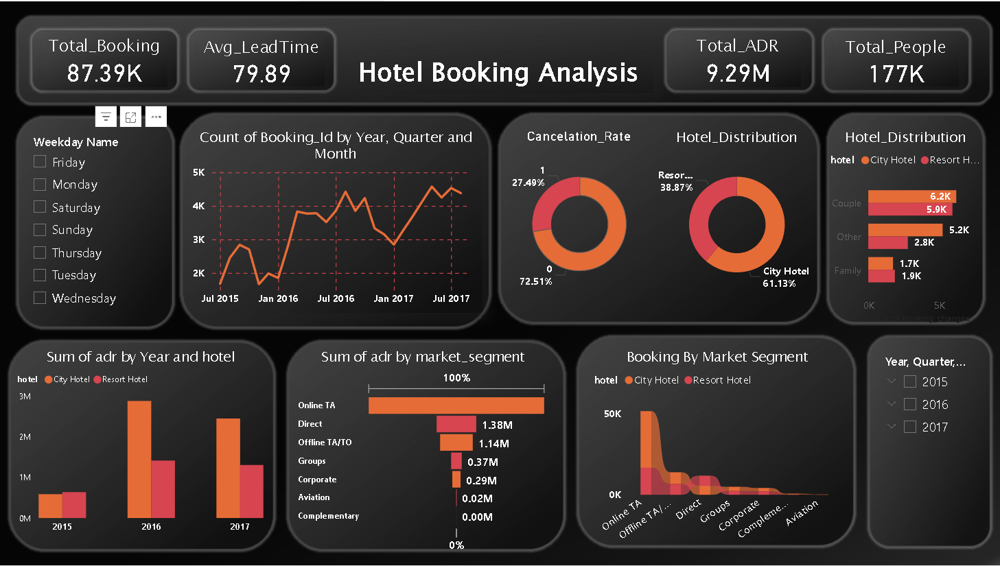

# 📊 Hotel Booking Dashboard - Power BI

This project presents an interactive **Hotel Booking Dashboard** built in **Power BI**.  
It transforms raw hotel booking data into actionable insights, helping understand **guest behavior, booking trends, and revenue performance**.

---

## 📸 Dashboard Preview

## 🔑 Key Features
- 📅 **Booking Trends** – arrival dates by year, month, week number  
- 🛏️ **Guest Segmentation** – Adults, Children, Babies → classified into *Couple* and *Family*  
- 📈 **KPIs** – ADR (Average Daily Rate), stay duration, cancellations, repeated guests  
- 🌍 **Market Insights** – bookings by country, distribution channels, and customer type  
- 🏨 **Room Analysis** – reserved vs assigned rooms, booking changes, special requests  

---

## 🛠️ Tools & Skills
- **Power BI** → DAX, Data Modeling, Interactive Visualizations  
- **Power Query** → Data Cleaning & Transformation  
- **Data Analytics** → Trend Analysis, Segmentation, Forecasting  

---

## 📌 Insights
- Identified seasonal & weekly booking patterns  
- Classified guests into *Couple* vs *Family* for better segmentation  
- Tracked cancellations and repeated guest trends  
- Compared actual vs expected performance for better forecasting  

---

## 📂 Project Structure
-Hotel Booking - Raw Data Set
-Hotel Booking Report - Report
-Power Bi Dashboard
